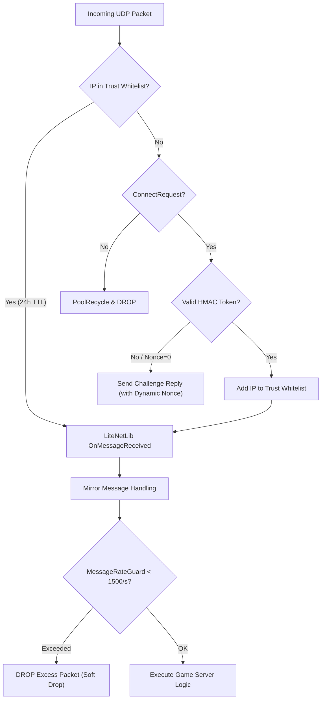

# 🛡️ AntiDDoS — LabAPI Plugin for SCP: Secret Laboratory

<p align="center">
  <b>🇬🇧 English</b> | <a href="README.md">🇷🇺 Русский</a>
</p>

<p align="center">
  <a href="https://github.com/vymi-platforms/SCPSL-AntiDDoS/releases"></a>
  <a href="AntiDDoS/AntiDDoS.csproj"></a>
  <a href="https://github.com/CedMod/LabApi"></a>
  <a href="LICENSE"></a>
  
</p>

> **AntiDDoS** is an advanced application-layer (L7) deep network protection plugin for **SCP: Secret Laboratory** dedicated servers powered by LabAPI. The plugin mitigates architectural vulnerabilities in the Mirror networking engine and LiteNetLib transport, prevents incoming connection spoofing, blocks server-crash exploits, and guarantees thread-safe network message marshaling.

---

> [!IMPORTANT]
> ### 🛡️ Part of the Baleygr Protection Suite by Vymi
> This plugin is an integral component of the **Baleygr** DDoS protection suite developed by **Vymi**.
>
> **Please note:** This plugin operates at the application layer (L7) directly inside the game server process. **This plugin alone will not protect against many types of attacks** (such as volumetric L3/L4 network floods, UDP amplification/reflection attacks, uplink bandwidth exhaustion, or operating system socket starvation).
>
> To acquire and deploy the **full comprehensive protection** for your game infrastructure, please reach out via email:  
> 📧 **`mail@wexels.dev`**

---

## 📑 Table of Contents

- [🛡️ AntiDDoS — LabAPI Plugin for SCP: Secret Laboratory](#️-antiddos--labapi-plugin-for-scp-secret-laboratory)
  - [📑 Table of Contents](#-table-of-contents)
  - [🏗️ Architecture Overview](#️-architecture-overview)
  - [🛡️ Key Protection Modules](#️-key-protection-modules)
    - [1. Anti-Spoofing \& Handshake Challenge](#1-anti-spoofing--handshake-challenge)
    - [2. Network Exploits Guard (Security Advisories)](#2-network-exploits-guard-security-advisories)
    - [3. Intelligent Message Rate Limiting](#3-intelligent-message-rate-limiting)
    - [4. Voice Chat \& Subroutine Guard](#4-voice-chat--subroutine-guard)
    - [5. AFK Guard \& Connection Stability](#5-afk-guard--connection-stability)
    - [6. SecureNetThreading (Thread Safety)](#6-securenetthreading-thread-safety)
  - [🔄 Traffic Flow Pipeline](#-traffic-flow-pipeline)
  - [🛠️ Building \& Installation](#️-building--installation)
    - [Requirements:](#requirements)
    - [Building from Source:](#building-from-source)
    - [Installation from Releases:](#installation-from-releases)
  - [📊 Logging \& Console Diagnostics](#-logging--console-diagnostics)
  - [🛡️ Comprehensive Baleygr Protection](#️-comprehensive-baleygr-protection)
  - [👥 Authors \& Contact](#-authors--contact)

---

## 🏗️ Architecture Overview

Historically, the SCP:SL network architecture relies on Unity's **Mirror Networking** paired with the **LiteNetLib** UDP transport. Out of the box, this stack is vulnerable to reflection attacks, memory leaks from incomplete fragmented packets, I/O blocking during disk-based ban lookups, and fatal crashes when network methods are invoked from non-main threads (such as Discord bots, database connectors, or asynchronous HTTP callbacks).

**AntiDDoS Plugin** hooks into critical points of the networking pipeline via **Harmony**, enforcing strict, fail-safe heuristics while ensuring 100% smooth, stutter-free legitimate gameplay.

---

## 🛡️ Key Protection Modules

### 1. Anti-Spoofing & Handshake Challenge
*Implementation: [`CheckBeforeConnection.cs`](AntiDDoS/Patches/AntiSpoofing/CheckBeforeConnection.cs)*

- **Stateless Challenge-Response:** Prevents spoofed UDP connection requests. Before memory or session resources are allocated on the server, the client must prove IP ownership using a cryptographic HMAC token.
- **Dynamic Nonce Generation:** Generates a unique `nonce` registered directly into `CustomLiteNetLib4MirrorTransport.Challenges`, preventing validation desync and `invalid Challenge ID` disconnects.
- **Trust Whitelist:**
  - Whitelist TTL: **24 hours** (86,400 seconds).
  - Any valid packet from an active connected peer (`TryGetPeer`) automatically extends trust for another 24 hours.
- **Source Engine Query (SEQ / A2S_INFO):** Shields Steam server browser queries from amplification and reflection attacks. Info query responses require token validation with strict rate limits.

---

### 2. Network Exploits Guard (Security Advisories)
*Implementations: [`PreauthHardening.cs`](AntiDDoS/Patches/Preauth/PreauthHardening.cs), [`FragmentTtl.cs`](AntiDDoS/Patches/Exploits/FragmentTtl.cs), [`TransportLimits.cs`](AntiDDoS/Patches/Transport/TransportLimits.cs), [`UnbatcherGuard.cs`](AntiDDoS/Patches/Exploits/UnbatcherGuard.cs), [`EventsBudget.cs`](AntiDDoS/Patches/Transport/EventsBudget.cs)*

| Advisory | Vulnerability Description                                           | Solution in Plugin                                                                                                                                                               |
| :------: | :------------------------------------------------------------------ | :------------------------------------------------------------------------------------------------------------------------------------------------------------------------------- |
| **0004** | Preauth queue exhaustion exploit via garbage `ConnectRequest` flood | Fail-closed heuristic: clears pending request counter, enforces strict per-IP rate limits and token validation.                                                                  |
| **0011** | Fragment Holding memory leak attack                                 | Periodic eviction of abandoned LiteNetLib fragment sets (`_holdedFragments`). Legitimate sets (e.g. voice) remain protected; eviction triggers only on DoS anomalies (>64 sets). |
| **0012** | Pending connection requests dictionary overflow (`_requestsDict`)   | Periodic automatic sweep of `_requestsDict` when pending entries exceed 1024.                                                                                                    |
| **0013** | UDP reflection & phantom `Disconnect` packets from non-peers        | Silent drop of `Disconnect`, `PeerNotFound`, and empty datagrams from non-connected endpoints. Unconnected message limiter (250/s per IP).                                       |
| **0014** | Unbatcher message accumulation during scene transitions             | Enforces a maximum packet size cap of **64 KB** and a 2 MB per-client buffer cap when `NetworkServer.isLoadingScene`.                                                            |
| **0015** | Infinite event loop and unhandled event exceptions                  | Event pump budgeting (`EventsBudget`) capped at **30 ms per frame** (up to 5,000 actions) with per-action exception isolation.                                                   |
| **0022** | Disk I/O server freeze during ban checks (`BanHandler.QueryBan`)    | In-memory cache for ban check queries with a 5-second TTL (up to 10,000 entries), preventing disk lockups during banned ID floods.                                               |

---

### 3. Intelligent Message Rate Limiting
*Implementation: [`MessageRateGuard.cs`](AntiDDoS/Patches/Exploits/MessageRateGuard.cs)*

- **Token Bucket Algorithm:** Capacity of **2,500 messages**, refill rate of **1,500 messages/sec** per connection.
- **Soft Drop Instead of Kick:** When legitimate network spikes occur (e.g. unbatching after micro-stutter, intense firefights with voice chat), the plugin **does not kick** the player with `The specified host is not available`. It gracefully drops only the excess packets.
- Protects against malicious "message bomb" exploits (50,000+ msg/s) instantly without degrading tick rate.

---

### 4. Voice Chat & Subroutine Guard
*Implementations: [`VoiceGuard.cs`](AntiDDoS/Patches/Gameplay/VoiceGuard.cs), [`SubroutineGuard.cs`](AntiDDoS/Patches/Gameplay/SubroutineGuard.cs)*

- **Voice Guard (0021):**
  - Caps maximum voice frame payload at **1024 bytes**.
  - Rate-limit: 100 voice messages/s with a burst allowance of 150 (standard Opus codec transmits ~50 frames/s).
  - Active voice transmission automatically resets the AFK inactivity timer.
- **Subroutine & Mimicry Guard (0019):**
  - Subroutine trigger limit (`SubroutineMessage`): max **20/s**.
  - SCP-939 Voice Mimicry cooldown (`MimicryTransmitter`): capped to **2.5/s** to prevent audio engine desync and micro-freezes.

---

### 5. AFK Guard & Connection Stability
*Implementation: [`AfkGuard.cs`](AntiDDoS/Patches/Gameplay/AfkGuard.cs)*

- **Disable Mirror Inactivity Timeout:** Disables Mirror's default aggressive disconnects on temporary packet stalls (`NetworkServer.disconnectInactiveConnections = false`).
- **Server Configuration Sync:** If the server config disables AFK kicking (`afk_time <= 0`), the plugin prevents automatic kicks in both `AFKManager` and `BanPlayer.KickUser`.
- Players communicating via voice chat are never falsely kicked by the server.

---

### 6. SecureNetThreading (Thread Safety)
*Implementation: [`SecureNetThreading.cs`](AntiDDoS/Patches/SecureNetThreading.cs)*

- In Unity's Mirror architecture, calling `NetworkConnection.Send` or interacting with `NetworkWriterPool` from outside the Unity Main Thread is unsafe and causes fatal memory corruption.
- When third-party plugins call network methods from worker threads (e.g. async Discord bots, MySQL/SQLite queries, webhooks), server stability is compromised.
- **SecureNetThreading:**
  - Intercepts calls initiated from background threads.
  - Safely enqueues the payload into `_pendingSends`.
  - Automatically flushes all queued packets on the Unity Main Thread during the next `FixedUpdate`.

---

## 🔄 Traffic Flow Pipeline



---

## 🛠️ Building & Installation

### Requirements:
- [.NET SDK](https://dotnet.microsoft.com/download) (.NET 8 / 9 SDK or MSBuild)
- Target Framework: `.NET Framework 4.8`
- [SCP: Secret Laboratory](https://scpslgame.com/) dedicated server with [LabAPI](https://github.com/CedMod/LabApi)

### Building from Source:

```bash
# Clone the repository
git clone https://github.com/vymi-platforms/SCPSL-AntiDDoS.git
cd SCPSL-AntiDDoS

# Build Release binary
dotnet build AntiDDoS/AntiDDoS.csproj -c Release
```

The compiled assembly will be produced at:
```text
AntiDDoS/bin/Release/net48/AntiDDoS.dll
```

### Installation from Releases:
1. Download `AntiDDoS.dll` from the latest [GitHub Release](https://github.com/vymi-platforms/SCPSL-AntiDDoS/releases).
2. Stop your SCP:SL server.
3. Place `AntiDDoS.dll` into your LabAPI plugins directory:
   - **Linux:** `~/.config/SCP Secret Laboratory/PluginAPI/plugins/<port>/` (or global plugins directory).
   - **Windows:** `%APPDATA%\SCP Secret Laboratory\PluginAPI\plugins\<port>\`.
4. Start the server.

---

## 📊 Logging & Console Diagnostics

On server startup, the plugin logs initialization of all patches and guards:

```text
[INFO] [AntiDDoS] disable Mirror inactivity disconnect on server setup: applied
[INFO] [AntiDDoS] respect disabled AFK timer in AFKManager: applied
[INFO] [AntiDDoS] guard AFK kick when afk_time is disabled: applied
[INFO] [AntiDDoS] 0011: fragment-holding TTL + budget eviction: applied
[INFO] [AntiDDoS] 0014: realistic max message size (<=64KB): applied
[INFO] [AntiDDoS] 0014: unbatcher accumulation cap during scene load (2MB): applied
[INFO] [AntiDDoS] 0015: budgeted + exception-isolated event pump (30ms/frame): applied
[INFO] [AntiDDoS] message-rate guard: 1500 msg/s per connection (Messages bomb): applied
[INFO] [AntiDDoS] 0004: fail-closed pending-request heuristic: applied
[INFO] [AntiDDoS] 0022: BanHandler.QueryBan in-memory cache (5s TTL): applied
[INFO] [AntiDDoS] 0013: silent drop of reflection-prone packets from non-peers: applied
[INFO] [AntiDDoS] 0012: bounded connection-request dict: applied
[INFO] [AntiDDoS] 0019: SubroutineMessage rate limit: applied
[INFO] [AntiDDoS] 0019: MimicryTransmitter broadcast cooldown: applied
[INFO] [AntiDDoS] 0021: voice relay rate limit + payload cap: applied
```

Periodic diagnostic log:
```text
Anti-Spoofing processed 4 connection[s] within the last 10 seconds.
```

---

## 🛡️ Comprehensive Baleygr Protection

This plugin is part of the **Baleygr** DDoS protection suite provided by **Vymi**.

> [!WARNING]
> While this plugin effectively resolves internal protocol vulnerabilities, exploits, and server crashes at the application layer (L7), **it will not protect your server from many external attack vectors on its own:**
> - Volumetric L3/L4 floods (SYN floods, UDP floods, ICMP attacks);
> - High-bandwidth reflection & amplification attacks (DNS, NTP, SSDP, Memcached);
> - Uplink saturation and operating system kernel socket exhaustion.

To deploy **full comprehensive protection** for your entire server infrastructure, reach out to us:  
📧 **[mail@wexels.dev](mailto:mail@wexels.dev)**

---

## 👥 Authors & Contact

- 👨‍💻 **Lead Developer & Maintainer:** [@wexelsdev](https://github.com/wexelsdev) (`wexels.dev`)
  - Contact / Comprehensive Protection inquiries: [mail@wexels.dev](mailto:mail@wexels.dev)
- 🏢 **Project / Organization:** [Vymi Platforms](https://github.com/vymi-platforms)
- 🤝 **Base Plugin:** based on the original plugin by [@I-WAS-FUTURE](https://github.com/I-WAS-FUTURE) ([AntiDDoS repository](https://github.com/I-WAS-FUTURE/AntiDDoS))
