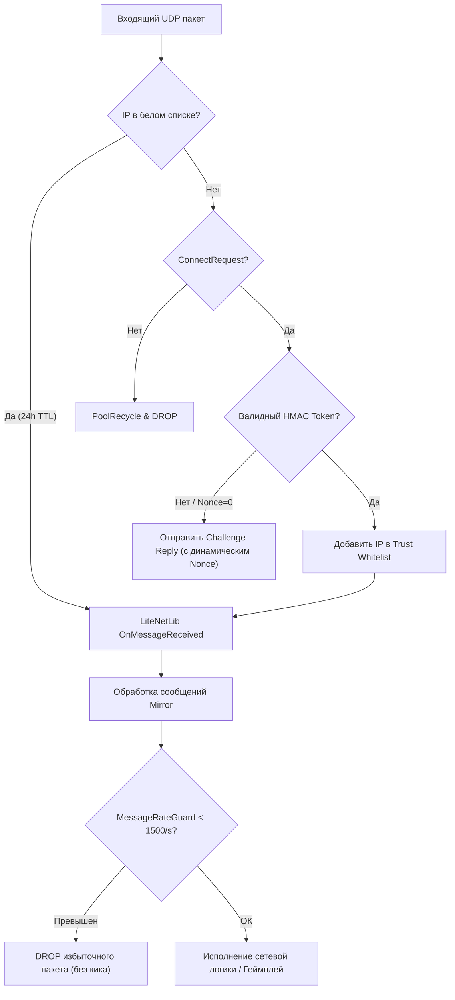

# 🛡️ AntiDDoS — LabAPI Plugin for SCP: Secret Laboratory

<p align="center">
  <a href="README.en.md">🇬🇧 English</a> | <b>🇷🇺 Русский</b>
</p>

<p align="center">
  <a href="https://github.com/vymi-platforms/SCPSL-AntiDDoS/releases"></a>
  <a href="AntiDDoS/AntiDDoS.csproj"></a>
  <a href="https://github.com/CedMod/LabApi"></a>
  
</p>

> **AntiDDoS** — серверный плагин глубокой сетевой защиты прикладного уровня (L7) для игровых серверов **SCP: Secret Laboratory** (LabAPI). Плагин устраняет архитектурные уязвимости игрового протокола Mirror и сетевого транспорта LiteNetLib, блокирует спуфинг входящих подключений, отражает эксплойты краша сервера и обеспечивает потокобезопасный маршалинг сетевых сообщений.

---

> [!IMPORTANT]
> ### 🛡️ Часть комплексной защиты Baleygr от Vymi
> Данный плагин является составной частью системы защиты от DDoS-атак **Baleygr** от **Vymi**.
>
> **Обратите внимание:** плагин обеспечивает фильтрацию и защиту исключительно на прикладном уровне (L7) внутри процесса игрового сервера. **В соло данный плагин не защитит от многих видов атак** (например, от масштабного канального флуда L3/L4, UDP Amplification/Reflection, переполнения пропускной способности канала хостинга и истощения сокетов операционной системы).
>
> Для приобретения и подключения **полной комплексной защиты** игровых серверов напишите на почту:  
> 📧 **`mail@wexels.dev`**

---

## 📑 Содержание

- [🛡️ AntiDDoS — LabAPI Plugin for SCP: Secret Laboratory](#️-antiddos--labapi-plugin-for-scp-secret-laboratory)
  - [📑 Содержание](#-содержание)
  - [🏗️ Обзор архитектуры](#️-обзор-архитектуры)
  - [🛡️ Ключевые модули защиты](#️-ключевые-модули-защиты)
    - [1. Анти-спуфинг и Handshake Challenge](#1-анти-спуфинг-и-handshake-challenge)
    - [2. Защита от сетевых эксплойтов (Security Advisories)](#2-защита-от-сетевых-эксплойтов-security-advisories)
    - [3. Интеллектуальный Rate Limiting сообщений](#3-интеллектуальный-rate-limiting-сообщений)
    - [4. Защита голосового чата и подпрограмм](#4-защита-голосового-чата-и-подпрограмм)
    - [5. AFK Guard и стабильность соединений](#5-afk-guard-и-стабильность-соединений)
    - [6. SecureNetThreading (Потокобезопасность)](#6-securenetthreading-потокобезопасность)
  - [🔄 Схема обработки трафика](#-схема-обработки-трафика)
  - [🛠️ Сборка и установка](#️-сборка-и-установка)
    - [Требования:](#требования)
    - [Сборка из исходников:](#сборка-из-исходников)
    - [Установка готового релиза:](#установка-готового-релиза)
  - [📊 Логирование и консольный вывод](#-логирование-и-консольный-вывод)
  - [🛡️ Комплексная защита Baleygr](#️-комплексная-защита-baleygr)
  - [👥 Авторы и контакты](#-авторы-и-контакты)

---

## 🏗️ Обзор архитектуры

Сетевой движок SCP:SL исторически полагается на комбинацию **Mirror Networking** и UDP-библиотеки **LiteNetLib**. По умолчанию эта связка подвержена атакам отражения (reflection), утечкам памяти при получении неполных фрагментов, блокировкам ввода-вывода (I/O) при чтении списков банов и крашам при вызове сетевого кода из сторонних фоновых потоков (Discord-боты, базы данных, асинхронные вебхуки).

**AntiDDoS Plugin** перехватывает сетевые вызовы на ключевых этапах с помощью **Harmony** и применяет строгие, отказоустойчивые (fail-safe) фильтры, сохраняя при этом 100% плавность легитимного геймплея.

---

## 🛡️ Ключевые модули защиты

### 1. Анти-спуфинг и Handshake Challenge
*Файл реализации: [`CheckBeforeConnection.cs`](AntiDDoS/Patches/AntiSpoofing/CheckBeforeConnection.cs)*

- **Stateless Challenge-Response:** Предотвращает подключение с поддельных (spoofed) IP-адресов. Перед выделением памяти на сервере клиент обязан подтвердить владение IP через криптографический HMAC-токен.
- **Динамический Nonce:** Генерация уникального `nonce` и прямая регистрация в `CustomLiteNetLib4MirrorTransport.Challenges`, исключающая рассинхронизацию валидации и ошибку `invalid Challenge ID`.
- **Доверенный белый список (Trust Whitelist):** 
  - TTL доверия — **24 часа** (86 400 сек).
  - Любой валидный пакет от уже подключённого игрока (`TryGetPeer`) автоматически продлевает доверие ещё на 24 часа.
- **Source Engine Query (SEQ / A2S_INFO):** Защита браузера серверов Steam от атак типа Amplification/Reflection. Ответы на запросы информации о сервере выдаются только после валидации challenge/token с ограничением частоты ответов.

---

### 2. Защита от сетевых эксплойтов (Security Advisories)
*Файлы реализации: [`PreauthHardening.cs`](AntiDDoS/Patches/Preauth/PreauthHardening.cs), [`FragmentTtl.cs`](AntiDDoS/Patches/Exploits/FragmentTtl.cs), [`TransportLimits.cs`](AntiDDoS/Patches/Transport/TransportLimits.cs), [`UnbatcherGuard.cs`](AntiDDoS/Patches/Exploits/UnbatcherGuard.cs), [`EventsBudget.cs`](AntiDDoS/Patches/Transport/EventsBudget.cs)*

| Advisory | Описание уязвимости                                                     | Решение в плагине                                                                                                                                                          |
| :------: | :---------------------------------------------------------------------- | :------------------------------------------------------------------------------------------------------------------------------------------------------------------------- |
| **0004** | Эксплойт зависания очереди Preauth (поток мусорных `ConnectRequest`)    | Fail-closed эвристика: обнуление счётчика ожидающих запросов и принудительное применение rate-limit и валидации токенов.                                                   |
| **0011** | Эксплойт утечки памяти фрагментов (Fragment Holding Attack)             | Очистка зависших фрагментов LiteNetLib (`_holdedFragments`). Обычные сеты фрагментов (войс) защищены, сброс происходит только при DoS-аномалиях (>64 сетов).               |
| **0012** | Переполнение словаря запросов на подключение (`_requestsDict`)          | Автоматический периодический сброс (sweep) словаря `_requestsDict` при превышении лимита в 1024 ожидающих запроса.                                                         |
| **0013** | UDP-рефлексия и отправка фантомных пакетов `Disconnect` от не-пиров     | Молчаливый сброс пакетов `Disconnect`, `PeerNotFound` и пустых датаграмм, если отправитель не является активным пиром. Ограничение неподключённых сообщений (250/с на IP). |
| **0014** | Аккумуляция пакетов распаковщика во время смены раунда / загрузки сцены | Ограничение максимального размера пакета до **64 КБ**, а также кап накопления данных в 2 МБ на клиента при `NetworkServer.isLoadingScene`.                                 |
| **0015** | Бесконечный цикл обработки сетевых событий и краш от исключений         | Бюджетирование насоса событий (`EventsBudget`) — максимум **30 мс на кадр** (до 5000 действий) с изоляцией исключений каждого отдельного действия.                         |
| **0022** | Дисковый I/O фриз при проверке банов (`BanHandler.QueryBan`)            | In-memory кэш результатов проверки банов с TTL 5 секунд и емкостью до 10 000 записей. Предотвращает зависание сервера при флуде забаненными ID.                            |

---

### 3. Интеллектуальный Rate Limiting сообщений
*Файл реализации: [`MessageRateGuard.cs`](AntiDDoS/Patches/Exploits/MessageRateGuard.cs)*

- **Токен-бакет:** Емкость — **2500 сообщений**, скорость восстановления — **1500 сообщений/сек** на каждого игрока.
- **Мягкий сброс вместо кика:** При кратковременных лагах и всплесках сетевого трафика (например, распаковка пачки пакетов после микрофриза или интенсивная стрельба с войсом) плагин **не отключает** игрока с ошибкой `The specified host is not available`, а безопасно отбрасывает только избыточный пакет.
- Эксплойты типа «сообщенческих бомб» (50 000+ msg/s) пресекаются мгновенно без деградации сервера.

---

### 4. Защита голосового чата и подпрограмм
*Файлы реализации: [`VoiceGuard.cs`](AntiDDoS/Patches/Gameplay/VoiceGuard.cs), [`SubroutineGuard.cs`](AntiDDoS/Patches/Gameplay/SubroutineGuard.cs)*

- **Voice Guard (0021):**
  - Ограничение размера голосового фрейма: максимум **1024 байта**.
  - Rate-limit: 100 голосовых сообщений в секунду с буфером всплеска до 150 (стандартный Opus-кодек передает ~50 фреймов/сек).
  - Голосовая активность автоматически сбрасывает секундомер AFK-таймера.
- **Subroutine & Mimicry Guard (0019):**
  - Лимит вызова триггеров подпрограмм (`SubroutineMessage`): не более **20/с**.
  - Защита мимикрии голосов SCP-939 (`MimicryTransmitter`): кулдаун трансляции **2.5/с** во избежание спама и микрофризов аудиодвижка.

---

### 5. AFK Guard и стабильность соединений
*Файл реализации: [`AfkGuard.cs`](AntiDDoS/Patches/Gameplay/AfkGuard.cs)*

- **Отключение Mirror Inactivity Timeout:** По умолчанию Mirror отключает соединения при временном отсутствии пакетов (`NetworkServer.disconnectInactiveConnections = false`).
- **Синхронизация с конфигом сервера:** Если в настройках сервера AFK-кик отключён (`afk_time <= 0`), плагин блокирует автоматические кики в `AFKManager` и `BanPlayer.KickUser`.
- Говорящие в войс игроки больше не кикаются сервером по ошибке.

---

### 6. SecureNetThreading (Потокобезопасность)
*Файл реализации: [`SecureNetThreading.cs`](AntiDDoS/Patches/SecureNetThreading.cs)*

- В архитектуре Unity Mirror вызовы `NetworkConnection.Send` и пула `NetworkWriterPool` категорически запрещено выполнять вне главного потока (Main Thread).
- При нарушении этого правила сторонними плагинами (например, отправка сообщения игроку из асинхронного Discord-события или колбэка базы данных) происходит фатальный сбой сетевого клиента.
- **SecureNetThreading:**
  - Перехватывает вызовы из фоновых потоков.
  - Безопасно помещает сообщение в очередь `_pendingSends`.
  - Автоматически выкачивает (flush/pump) накопленные пакеты в главном потоке во время ближайшего `FixedUpdate`.

---

## 🔄 Схема обработки трафика



---

## 🛠️ Сборка и установка

### Требования:
- [.NET SDK](https://dotnet.microsoft.com/download) (рекомендуется .NET 8 / 9 SDK или MSBuild)
- Целевая платформа: `.NET Framework 4.8`
- Сервер [SCP: Secret Laboratory](https://scpslgame.com/) с установленным [LabAPI](https://github.com/CedMod/LabApi)

### Сборка из исходников:

```bash
# Клонирование репозитория
git clone https://github.com/vymi-platforms/SCPSL-AntiDDoS.git
cd SCPSL-AntiDDoS

# Сборка Release-конфигурации
dotnet build AntiDDoS/AntiDDoS.csproj -c Release
```

Скомпилированная библиотека будет находиться в:
```text
AntiDDoS/bin/Release/net48/AntiDDoS.dll
```

### Установка готового релиза:
1. Скачайте последнюю версию `AntiDDoS.dll` со страницы [GitHub Releases](https://github.com/vymi-platforms/SCPSL-AntiDDoS/releases).
2. Остановите игровой сервер SCP:SL.
3. Поместите `AntiDDoS.dll` в директорию плагинов LabAPI:
   - **Linux:** `~/.config/SCP Secret Laboratory/PluginAPI/plugins/<port>/` (или общую папку плагинов).
   - **Windows:** `%APPDATA%\SCP Secret Laboratory\PluginAPI\plugins\<port>\`.
4. Запустите сервер.

---

## 📊 Логирование и консольный вывод

При старте сервера плагин регистрирует Harmony-патчи и выводит статус инициализации модулей:

```text
[INFO] [AntiDDoS] disable Mirror inactivity disconnect on server setup: applied
[INFO] [AntiDDoS] respect disabled AFK timer in AFKManager: applied
[INFO] [AntiDDoS] guard AFK kick when afk_time is disabled: applied
[INFO] [AntiDDoS] 0011: fragment-holding TTL + budget eviction: applied
[INFO] [AntiDDoS] 0014: realistic max message size (<=64KB): applied
[INFO] [AntiDDoS] 0014: unbatcher accumulation cap during scene load (2MB): applied
[INFO] [AntiDDoS] 0015: budgeted + exception-isolated event pump (30ms/frame): applied
[INFO] [AntiDDoS] message-rate guard: 1500 msg/s per connection (Messages bomb): applied
[INFO] [AntiDDoS] 0004: fail-closed pending-request heuristic: applied
[INFO] [AntiDDoS] 0022: BanHandler.QueryBan in-memory cache (5s TTL): applied
[INFO] [AntiDDoS] 0013: silent drop of reflection-prone packets from non-peers: applied
[INFO] [AntiDDoS] 0012: bounded connection-request dict: applied
[INFO] [AntiDDoS] 0019: SubroutineMessage rate limit: applied
[INFO] [AntiDDoS] 0019: MimicryTransmitter broadcast cooldown: applied
[INFO] [AntiDDoS] 0021: voice relay rate limit + payload cap: applied
```

Периодическая сводка анти-спуфинга в консоли:
```text
Anti-Spoofing processed 4 connection[s] within the last 10 seconds.
```

---

## 🛡️ Комплексная защита Baleygr

Данный плагин входит в состав комплексного решения сетевой безопасности **Baleygr** от **Vymi**.

> [!WARNING]
> Этот плагин устраняет уязвимости игрового протокола Mirror / LiteNetLib и защищает сервер от падений, эксплойтов и зависаний на прикладном уровне.  
> **Однако в соло этот плагин не защитит от многих видов атак:**
> - Объемные канальные L3/L4 атаки (SYN Flood, UDP Flood, ICMP Flood);
> - Атаки с усилением (Amplification / Reflection: DNS, NTP, SSDP, Memcached);
> - Переполнение физического канала связи и истощение сокетов операционной системы.

Для подключения **полноценной комплексной защиты** сетевого периметра и инфраструктуры напишите нам:  
📧 **[mail@wexels.dev](mailto:mail@wexels.dev)**

---

## 👥 Авторы и контакты

- **Организация:** [Vymi Platforms LLC](https://github.com/vymi-platforms)
- **Разработчик:** `wexels.dev` (📧 [mail@wexels.dev](mailto:mail@wexels.dev))
- **Основа:** на базе наработок оригинального плагина *ФУТУР*-а
